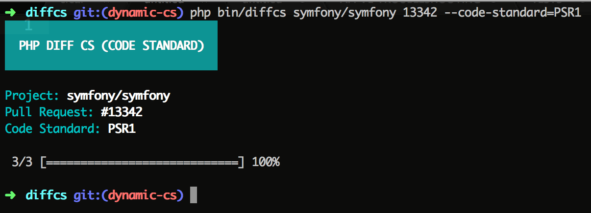

# DiffCS

A tool to perform PSR-2 check into your pull requests on Github.

## How To Install

Through **Composer**:

```
composer global require "marcelsud/diffcs":"dev-master"
```

We suggest you to use `global` requirement, so you can use for all projects.

Or cloning this project:

```
git clone git@github.com:marcelsud/diffcs.git
```

Once it's done, go to the root folder and execute:

```
composer install
```

Then, run the following command to use this tool through your `bin` folder:

```
sudo ln -nfs ~/.composer/vendor/bin/diffcs /usr/local/bin/diffcs
```

## How To Use

### For public repositories:

Run the following command: `diffcs <source>/<project> <pull request id>`, where:

- `<source>` is the corporation/user behind the project;
- `<project>` is the project name on Github;
- `<pull request id>` is the pull request id, created by Github.

**Example**:

```
diffcs symfony/symfony 13342
```

### For private repositories:

Execute following command: `diffcs <source>/<project> <pull request id> --github-user=<github username>`, where:

- `<github username>` is your Github username.

**Example**:

```
diffcs symfony/symfony 13342 --github-user=seuusuario
```

Once you run this command, provide your Github password. **The password is only required to authenticate your credentials into the private repository.**


